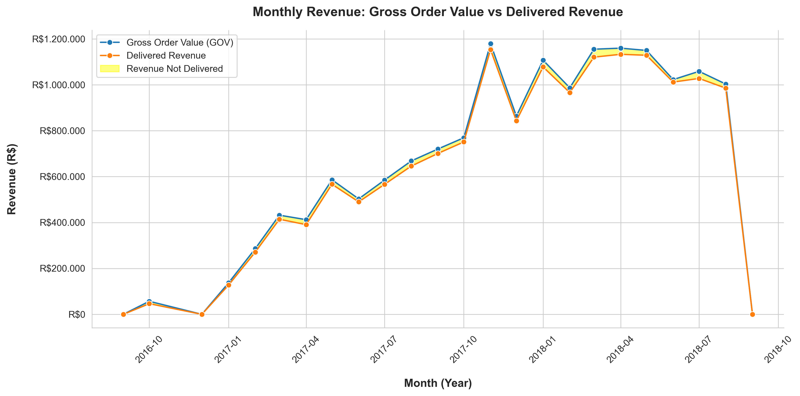
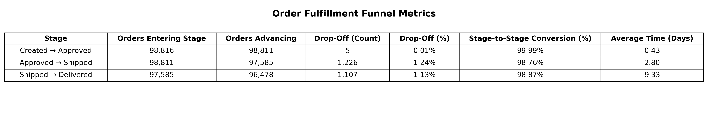
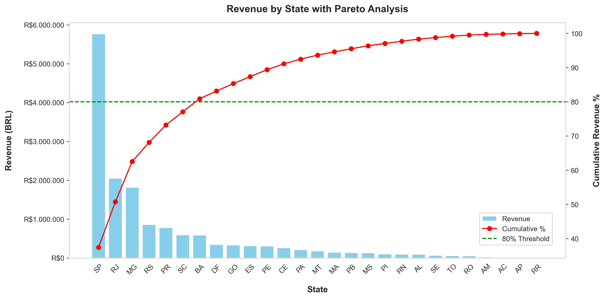
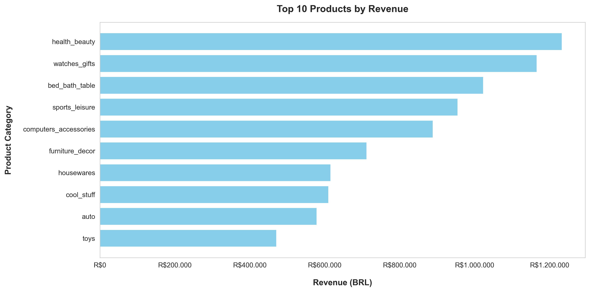
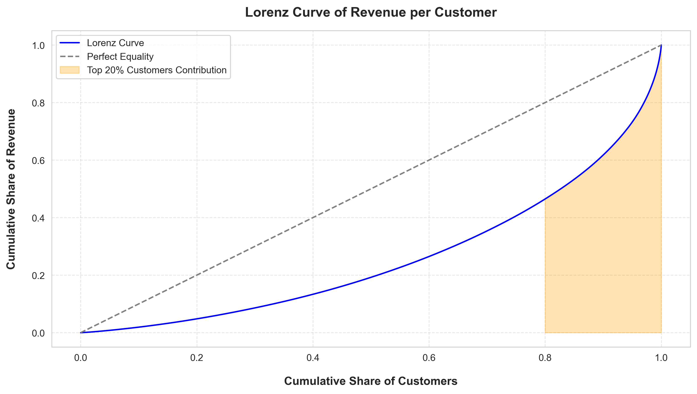
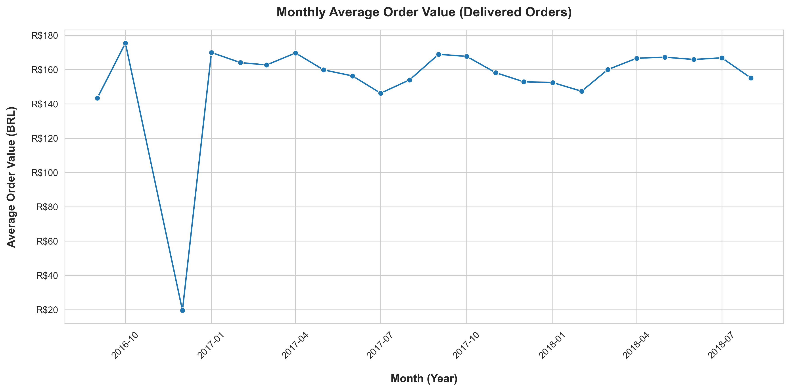
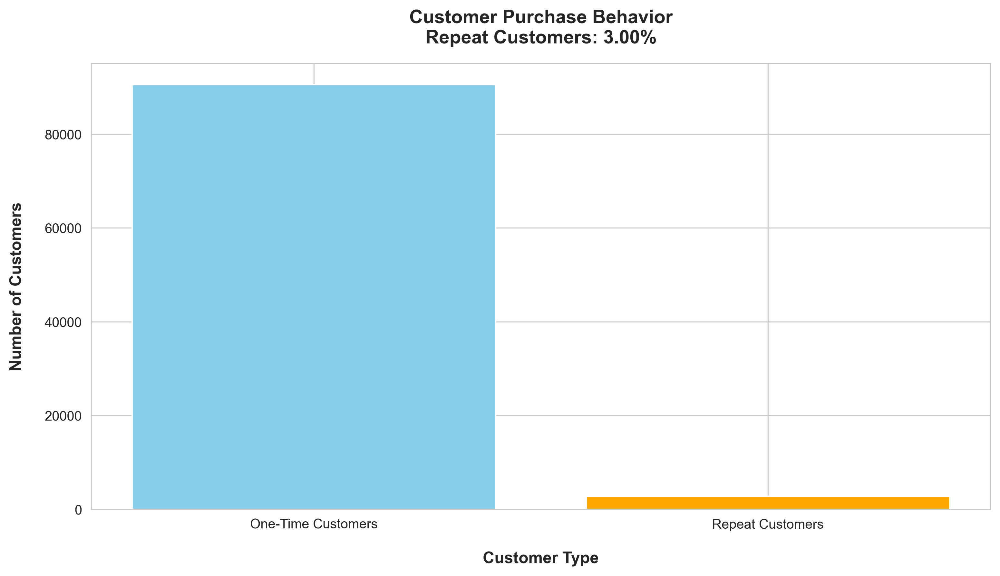

# E-Commerce Revenue Concentration & Growth Analysis: A Statistical Deep Dive into Olist Brazil


## Overview
This analysis examines approximately 100,000 Brazilian e-commerce orders from the Olist marketplace to understand revenue trends, geographic concentration, product category performance, and customer behavior.  

Key objectives:  
- Assess monthly revenue and fulfillment efficiency.  
- Identify top-performing states and product categories using Pareto analysis.  
- Measure revenue inequality among customers with Lorenz Curve and Gini coefficient.  
- Examine Average Order Value (AOV) and repeat purchase behavior.

The goal is to translate transactional data into actionable business insights that support e-commerce strategy, marketing focus, and product management decisions.

## Business Questions
- What are the monthly revenue trends and how does monthly revenue compare between all orders and delivered orders?  
- How efficiently do orders progress through the fulfillment funnel?  
- Where do orders drop off within the funnel, and which stage has the lowest conversion rate?  
- How long does it take for orders to move through each stage of the funnel?
- Which states contribute most to total revenue?  
- Which product categories generate the highest revenue?  
- How concentrated is revenue among top-performing states and categories?  
- How does AOV change over time?  
- What percentage of customers make repeat purchases?  

## Key Metrics
| Metric | Description | CSV | Plot |
|--------|------------|-----|------|
| Monthly Revenue | Trends in marketplace activity | [**monthly_revenue.csv**](data/monthly_revenue.csv) |  |
|Order Fulfillment Funnel |Stage-to-stage conversion, drop-offs, and processing times | [**funnel_stage_metrics.csv**](data/funnel_stage_metrics.csv) | |
| Revenue by State + Pareto | Geographic concentration | [**state_revenue.csv**](data/state_revenue.csv) |  |
| Top Product Categories | Revenue distribution across categories | [**product_revenue.csv**](data/product_revenue.csv) |  |
| Revenue Distribution and Concentration | Lorenz Curve & Gini coefficient | [**revenue_lorenz.csv**](data/revenue_lorenz.csv) |  |
| Monthly AOV | Average revenue per order | [**monthly_aov.csv**](data/monthly_aov.csv) |  |
| Repeat Customers | Customer retention metrics | [**repeat_customers.csv**](data/repeat_customers.csv) |  |  

## Tools & Setup
- **SQL / PostgreSQL** — Data extraction and aggregation  
- **Python (Pandas, NumPy, Seaborn, Matplotlib)** — Data manipulation and visualization  
- **Jupyter Notebook** — Interactive analysis and documentation 
- **Git / GitHub** — Version control and portfolio hosting  

> **Technical Note:** All SQL queries are included as comments for reference. CSV outputs and plots are pre-saved in the `data/` and `images/` folders, but can be regenerated by running the notebook.

## Analysis Workflow
1. **Data Exploration** — Examine structure, size, and sample rows of core tables (`orders`, `order_items`, `customers`).  
2. **Monthly Revenue Analysis** — Compare Gross Order Value (GOV) vs. Delivered Revenue.  
3. **Order Fulfillment Funnel Analysis** — Track order progression from creation to delivery, measure drop-offs, conversion rates, and average processing times.
4. **Revenue by State + Pareto Analysis** — Identify top-performing states and assess revenue concentration.  
5. **Top Product Categories Analysis** — Determine which categories generate the most revenue.  
6. **Revenue Distribution & Concentration (Lorenz Curve)** — Measure inequality among customers.  
7. **Monthly AOV** — Track average revenue per order over time.  
8. **Repeat Customer Analysis** — Assess repeat purchase behavior and customer retention.

## Key Insights
- **Monthly Revenue:** Delivered revenue grew steadily in 2017, peaking at ~R$1.15M in November 2017, remained near R$1M through August 2018, with a sharp decline in September 2018 influenced by cancellations.
- **Order Fulfillment Funnel:** Most orders (≈97.63%) reach delivery, with the largest drop-off at the Approved → Shipped stage (~1,226 orders, 1.24%). Average time between stages increases from 0.43 days to 9.33 days from order creation to customer delivery, highlighting last-mile delivery constraints.
- **Revenue by State:** Concentrated in SP, MG, and RJ; seven states contribute more than 80% of revenue.  
- **Top Product Categories:** 17 of 71 categories (~24%) account for 80% of revenue; top seven categories generate over 50% of revenue.  
- **Revenue Distribution and Concentration:** Gini coefficient = 0.479; top 20% of customers contribute disproportionately.  
- **Monthly AOV:** Peaks in October 2016 (~R$175); stable through 2018 (~R$147–R$167).  
- **Repeat Customers:** Only 3% of customers make multiple purchases, indicating low repeat buying behavior and a heavy reliance on new customer acquisition.

## Business Recommendations
- Focus marketing and resources on high-revenue states (`SP`, `MG`, `RJ`).  
- Investigate late-2018 revenue drop to identify operational issues or seasonal effects.
- Address the Approved → Shipped bottleneck to reduce cancellations and improve delivery efficiency. 
- Strengthen last-mile logistics and tracking to ensure timely delivery and enhance customer satisfaction.
- Leverage top product categories for inventory planning and promotional campaigns.  
- Implement retention strategies and loyalty programs to increase customer lifetime value. 

## Analysis Structure

```
Olist-Brazilian-Analysis/
|
|-- data/ (CSV outputs used in analysis)
| |-- monthly_revenue.csv
| |-- funnel_stage_metrics.csv
| |-- state_revenue.csv
| |-- product_revenue.csv
| |-- revenue_lorenz.csv
| |-- monthly_aov.csv
| |-- repeat_customers.csv
| |-- customers_sample.csv
| |-- orders_sample.csv
| |-- order_items_sample.csv
|
|-- images/ (Saved plots)
| |-- monthly_revenue.png
| |-- funnel_table.png
| |-- revenue_by_state_pareto.png
| |-- top_product_categories.png
| |-- lorenz_curve.png
| |-- monthly_aov.png
| |-- repeat_customers.png
|
|-- notebooks/
| |-- Olist_Brazilian_Analysis_CSV_version.ipynb
```